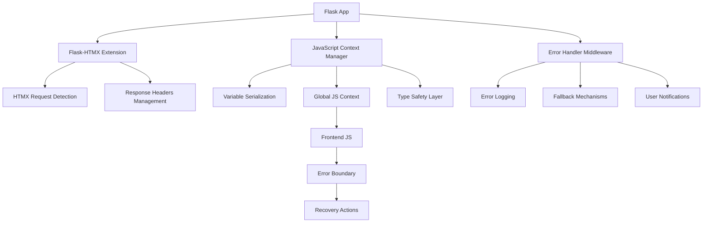
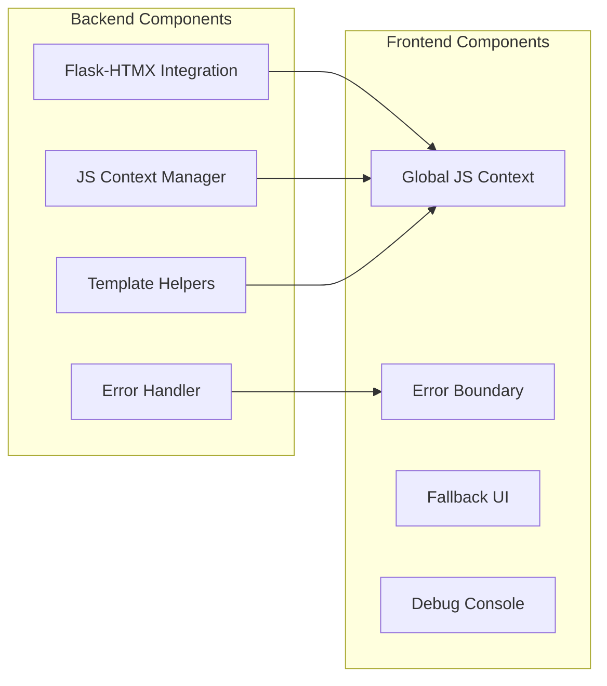
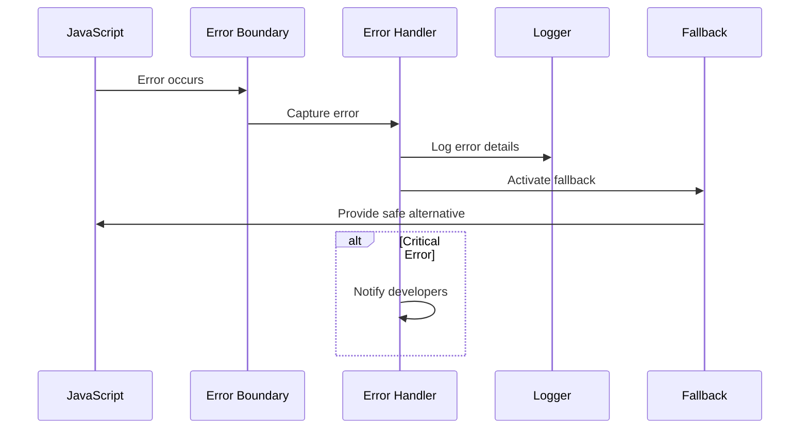

# Design Document

## Overview

Данный документ описывает архитектурное решение для системы улучшенной обработки JavaScript ошибок в Flask + HTMX приложении. Решение основано на анализе лучших практик сообщества и включает интеграцию Flask-HTMX extension, централизованную систему управления переменными и комплексную обработку ошибок.

## Architecture

### High-Level Architecture



### Component Architecture



## Components and Interfaces

### 1. Flask-HTMX Integration Component

**Purpose:** Стандартизация обработки HTMX запросов

**Key Classes:**
- `HTMXManager`: Основной класс для управления HTMX интеграцией
- `HTMXResponse`: Обертка для HTMX ответов
- `HTMXErrorHandler`: Специализированная обработка ошибок для HTMX

**Interfaces:**
```python
class HTMXManager:
    def __init__(self, app: Flask)
    def is_htmx_request(self) -> bool
    def render_partial(self, template: str, **context) -> str
    def handle_error(self, error: Exception) -> Response
```

### 2. JavaScript Context Manager

**Purpose:** Централизованное управление передачей данных в JavaScript

**Key Classes:**
- `JSContextManager`: Управление глобальным JS контекстом
- `VariableSerializer`: Безопасная сериализация Python объектов
- `TypeValidator`: Валидация типов данных

**Interfaces:**
```python
class JSContextManager:
    def add_variable(self, name: str, value: Any, safe: bool = True)
    def serialize_context(self) -> str
    def validate_types(self, context: dict) -> dict
    def get_safe_defaults(self) -> dict
```

### 3. Error Handler Component

**Purpose:** Комплексная обработка JavaScript ошибок

**Key Classes:**
- `JSErrorHandler`: Основной обработчик ошибок
- `ErrorLogger`: Логирование ошибок
- `FallbackManager`: Управление fallback механизмами

**Interfaces:**
```python
class JSErrorHandler:
    def setup_error_boundary(self)
    def log_error(self, error: dict)
    def notify_developers(self, error: dict)
    def activate_fallback(self, component: str)
```

### 4. Template Helper Component

**Purpose:** Безопасные хелперы для Jinja2 шаблонов

**Key Functions:**
- `js_safe()`: Безопасная передача переменных в JS
- `js_context()`: Генерация глобального JS контекста
- `htmx_attrs()`: Генерация HTMX атрибутов

## Data Models

### JavaScript Context Model

```python
@dataclass
class JSContext:
    variables: Dict[str, Any]
    defaults: Dict[str, Any]
    metadata: Dict[str, str]
    timestamp: datetime
    
    def to_json(self) -> str
    def validate(self) -> bool
    def merge_defaults(self) -> Dict[str, Any]
```

### Error Log Model

```python
@dataclass
class JSError:
    message: str
    stack: str
    url: str
    line: int
    column: int
    user_agent: str
    user_id: Optional[int]
    timestamp: datetime
    context: Dict[str, Any]
    
    def to_dict(self) -> dict
    def is_critical(self) -> bool
    def get_fingerprint(self) -> str
```

## Error Handling

### Error Categories

1. **Variable Undefined Errors**
   - Detection: `ReferenceError` patterns
   - Handling: Provide safe defaults
   - Recovery: Reload context or fallback UI

2. **Type Conversion Errors**
   - Detection: Type mismatch in serialization
   - Handling: Convert to safe types
   - Recovery: Use default values

3. **HTMX Integration Errors**
   - Detection: HTMX request failures
   - Handling: Graceful degradation
   - Recovery: Standard form submission

4. **Template Rendering Errors**
   - Detection: Jinja2 exceptions
   - Handling: Safe template fallbacks
   - Recovery: Minimal UI rendering

### Error Flow



## Testing Strategy

### Unit Testing
- **JSContextManager**: Тестирование сериализации и валидации
- **ErrorHandler**: Тестирование обработки различных типов ошибок
- **TemplateHelpers**: Тестирование безопасной генерации JS кода

### Integration Testing
- **Flask-HTMX Integration**: Тестирование HTMX запросов и ответов
- **End-to-End Error Handling**: Тестирование полного цикла обработки ошибок
- **Fallback Mechanisms**: Тестирование работы при отключенном JavaScript

### Browser Testing
- **Cross-browser Compatibility**: Тестирование в разных браузерах
- **JavaScript Disabled**: Тестирование fallback функциональности
- **Network Errors**: Тестирование обработки сетевых ошибок

## Implementation Plan

### Phase 1: Core Infrastructure
1. Установка и настройка Flask-HTMX extension
2. Создание базового JSContextManager
3. Настройка базовой обработки ошибок

### Phase 2: Error Handling System
1. Реализация JSErrorHandler
2. Настройка логирования ошибок
3. Создание системы уведомлений

### Phase 3: Template Integration
1. Создание безопасных template helpers
2. Рефакторинг существующих шаблонов
3. Добавление глобального JS контекста

### Phase 4: Fallback Mechanisms
1. Реализация fallback UI компонентов
2. Настройка graceful degradation
3. Тестирование без JavaScript

### Phase 5: Monitoring and Debugging
1. Настройка production мониторинга
2. Создание debug панели
3. Интеграция с системой алертов

## Security Considerations

### XSS Prevention
- Все пользовательские данные экранируются перед передачей в JavaScript
- Использование `|tojson|safe` фильтра Jinja2 для безопасной сериализации
- Валидация всех входящих данных

### CSRF Protection
- Интеграция с Flask-WTF CSRF токенами
- Автоматическое добавление CSRF токенов в HTMX запросы
- Валидация токенов на backend

### Content Security Policy
- Настройка CSP заголовков для предотвращения XSS
- Ограничение источников JavaScript кода
- Мониторинг нарушений CSP

## Performance Considerations

### JavaScript Bundle Size
- Минимизация размера JavaScript кода
- Lazy loading для неосновной функциональности
- Использование CDN для внешних библиотек

### Server-Side Performance
- Кэширование сериализованного JS контекста
- Оптимизация обработки HTMX запросов
- Асинхронное логирование ошибок

### Client-Side Performance
- Дебаунсинг для частых операций
- Оптимизация DOM манипуляций
- Использование requestAnimationFrame для анимаций

## Deployment Strategy

### Development Environment
- Включение подробного логирования ошибок
- Отображение ошибок в браузере
- Автоматическое обновление при изменениях

### Staging Environment
- Тестирование с production-подобными данными
- Проверка системы мониторинга
- Валидация fallback механизмов

### Production Environment
- Минимальное логирование для производительности
- Автоматические алерты для критических ошибок
- Graceful degradation для всех компонентов