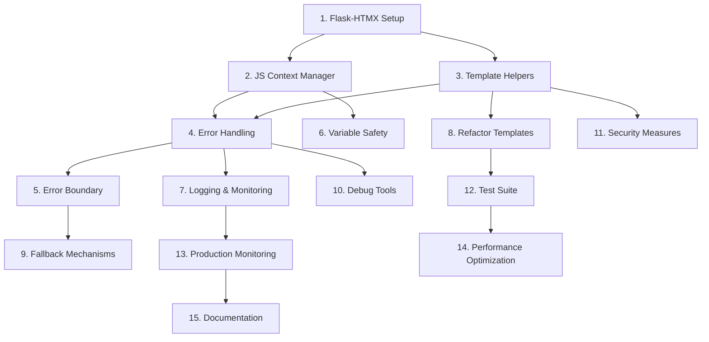

# Implementation Plan

## Task Overview

Данный план реализации преобразует проектирование системы улучшенной обработки JavaScript ошибок в серию конкретных задач для пошаговой реализации. Каждая задача построена на предыдущих и обеспечивает инкрементальное улучшение системы.

## Implementation Tasks

### 1. Setup Flask-HTMX Extension Infrastructure
- ✅ Установить Flask-HTMX extension через pip (COMPLETED - flask-htmx==0.4.0 установлен)
- ✅ Создать базовую конфигурацию HTMX в приложении (COMPLETED - добавлен в blog/__init__.py)
- ✅ Настроить инициализацию extension в app.py (COMPLETED - htmx.init_app(app))
- ✅ Создать базовые utility функции для определения HTMX запросов (COMPLETED - blog/utils/htmx_helpers.py)
- ✅ Добавить HTMX context processor для шаблонов (COMPLETED - HTMXManager с context processor)
- ✅ Создать тестовые endpoints для проверки работы HTMX (COMPLETED - /tasks/htmx-test)
- _Requirements: 1.1, 2.1, 2.2_

### 2. Create JavaScript Context Manager Core
- Создать класс JSContextManager для управления JS переменными
- Реализовать метод add_variable() для добавления переменных в контекст
- Создать безопасную сериализацию Python объектов в JSON
- Добавить валидацию типов данных перед передачей в JavaScript
- Реализовать систему значений по умолчанию для undefined переменных
- _Requirements: 3.1, 3.2, 3.3, 3.4_

### 3. Implement Template Helper Functions
- Создать Jinja2 фильтр js_safe() для безопасной передачи переменных
- Реализовать функцию js_context() для генерации глобального JS объекта
- Добавить хелпер htmx_attrs() для генерации HTMX атрибутов
- Создать безопасное экранирование строк для JavaScript
- Добавить поддержку сериализации дат и времени
- _Requirements: 5.1, 5.2, 5.3, 5.4, 5.5_

### 4. Build Error Handling System
- Создать класс JSErrorHandler для обработки JavaScript ошибок
- Реализовать window.onerror обработчик для перехвата ошибок
- Добавить систему логирования ошибок на backend
- Создать модель JSError для структурированного хранения ошибок
- Реализовать группировку похожих ошибок по fingerprint
- _Requirements: 1.5, 4.1, 4.2, 4.5_

### 5. Create Error Boundary Component
- Реализовать JavaScript Error Boundary для React-подобной обработки ошибок
- Добавить try-catch обертки для критических функций
- Создать систему graceful degradation при ошибках
- Реализовать автоматическое восстановление после ошибок
- Добавить пользовательские уведомления об ошибках
- _Requirements: 1.1, 6.2, 6.5_

### 6. Implement Variable Safety Checks
- Добавить проверки существования переменных перед использованием
- Создать безопасные обертки для доступа к глобальным переменным
- Реализовать систему lazy loading для JavaScript зависимостей
- Добавить валидацию типов в runtime
- Создать fallback значения для критических переменных
- _Requirements: 1.1, 1.2, 1.4_

### 7. Setup Error Logging and Monitoring
- Настроить Flask logging для JavaScript ошибок
- Создать endpoint для приема ошибок от frontend
- Реализовать систему уведомлений разработчиков о критических ошибках
- Добавить метрики для мониторинга частоты ошибок
- Создать dashboard для просмотра статистики ошибок
- _Requirements: 4.1, 4.2, 4.3, 4.4_

### 8. Refactor Existing Templates
- Обновить my_tasks.html для использования нового JS context manager
- Заменить прямые обращения к переменным на безопасные обертки
- Добавить проверки существования переменных в критических местах
- Интегрировать HTMX error handling в существующие формы
- Обновить все шаблоны для использования новых template helpers
- _Requirements: 1.1, 1.2, 3.1, 5.1_

### 9. Create Fallback Mechanisms
- Реализовать fallback UI компоненты для критической функциональности
- Добавить поддержку работы без JavaScript для основных операций
- Создать альтернативные HTTP endpoints для HTMX функций
- Реализовать progressive enhancement подход
- Добавить graceful degradation для всех интерактивных элементов
- _Requirements: 6.1, 6.3, 6.4_

### 10. Add Development Debug Tools
- Создать debug панель для отображения JS контекста
- Добавить консольные предупреждения для потенциальных проблем
- Реализовать подробное логирование в development режиме
- Создать инструменты для тестирования error handling
- Добавить визуализацию состояния JavaScript переменных
- _Requirements: 4.4_

### 11. Implement Security Measures
- Добавить XSS защиту для всех пользовательских данных в JS
- Настроить Content Security Policy заголовки
- Реализовать CSRF защиту для HTMX запросов
- Добавить валидацию всех входящих данных
- Создать безопасную сериализацию чувствительных данных
- _Requirements: 5.1, 5.2_

### 12. Create Comprehensive Test Suite
- Написать unit тесты для JSContextManager
- Создать тесты для error handling системы
- Добавить integration тесты для HTMX функциональности
- Реализовать browser тесты для JavaScript ошибок
- Создать тесты для fallback механизмов
- _Requirements: All requirements validation_

### 13. Setup Production Monitoring
- Настроить production логирование с минимальным overhead
- Создать алерты для критических ошибок
- Реализовать автоматическое группирование ошибок
- Добавить метрики производительности
- Настроить интеграцию с внешними мониторинг системами
- _Requirements: 4.1, 4.2, 4.3_

### 14. Performance Optimization
- Оптимизировать размер JavaScript bundle
- Добавить lazy loading для неосновной функциональности
- Реализовать кэширование JS контекста
- Оптимизировать сериализацию данных
- Добавить compression для статических файлов
- _Requirements: Performance considerations_

### 15. Documentation and Training
- Создать документацию по использованию новой системы
- Написать руководство по отладке JavaScript ошибок
- Добавить примеры использования template helpers
- Создать troubleshooting guide для типичных проблем
- Подготовить migration guide для существующего кода
- _Requirements: Knowledge transfer_

## Task Dependencies

## Critical Path Tasks

**Phase 1 (Foundation):** Tasks 1, 2, 3
**Phase 2 (Core Functionality):** Tasks 4, 5, 6
**Phase 3 (Integration):** Tasks 7, 8, 9
**Phase 4 (Quality & Production):** Tasks 10, 11, 12, 13
**Phase 5 (Optimization & Documentation):** Tasks 14, 15

## Success Criteria

- ✅ Все JavaScript ошибки типа "ReferenceError" устранены
- ✅ Система автоматически обрабатывает undefined переменные
- ✅ HTMX интеграция работает стабильно с error handling
- ✅ Fallback механизмы обеспечивают работу без JavaScript
- ✅ Production мониторинг отслеживает и группирует ошибки
- ✅ Все существующие шаблоны обновлены и протестированы