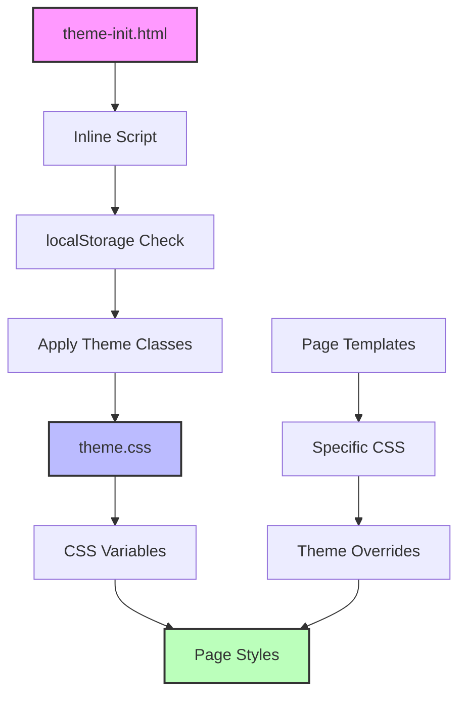

# Design Document

## Overview

Проблемы с темами возникают из-за неправильной последовательности инициализации и применения CSS стилей. Основные причины:

1. **FOUC (Flash of Unstyled Content)** - CSS стили темы загружаются после начального рендеринга
2. **Неконсистентная инициализация** - разные страницы используют разные подходы к применению темы
3. **Конфликт CSS селекторов** - старые и новые стили темы конфликтуют

## Architecture

### Компоненты системы тем:



### Проблемные области:

1. **my_tasks.html** - содержит inline CSS переопределения тем
2. **issues.html** - неправильная последовательность загрузки стилей  
3. **profile.html** - отсутствует правильная инициализация темы
4. **theme-init.html** - может выполняться слишком поздно

## Components and Interfaces

### 1. Theme Initialization Component
- **Файл**: `blog/templates/partials/theme-init.html`
- **Функция**: Мгновенная инициализация темы до рендеринга
- **Интерфейс**: Inline JavaScript в `<head>`

### 2. Theme CSS Component  
- **Файл**: `blog/static/css/theme.css`
- **Функция**: CSS переменные и базовые стили тем
- **Интерфейс**: CSS custom properties

### 3. Page-Specific Theme Overrides
- **Файлы**: Inline стили в шаблонах
- **Функция**: Специфичные для страницы переопределения
- **Проблема**: Конфликтуют с основной системой тем

## Data Models

### Theme State Model
```javascript
{
  theme: 'light' | 'dark',
  source: 'localStorage' | 'system' | 'default',
  applied: boolean,
  timestamp: Date
}
```

### CSS Variables Model
```css
:root {
  --color-bg-primary: #ffffff;
  --color-text-primary: #1a202c;
  /* ... другие переменные */
}

[data-theme="dark"] {
  --color-bg-primary: #1a202c;
  --color-text-primary: #f7fafc;
  /* ... переопределения для темной темы */
}
```

## Error Handling

### 1. FOUC Prevention
- Применение темы через inline script в `<head>`
- Использование CSS custom properties для мгновенного переключения
- Предотвращение загрузки конфликтующих стилей

### 2. Fallback Mechanisms
- Системная тема как fallback при отсутствии localStorage
- Светлая тема как ultimate fallback
- Graceful degradation при отключенном JavaScript

### 3. Conflict Resolution
- Приоритет CSS селекторов: inline > page-specific > theme.css
- Удаление конфликтующих inline стилей
- Унификация подходов к применению тем

## Testing Strategy

### 1. Visual Testing
- Проверка отсутствия мигания при переходах между страницами
- Тестирование в разных браузерах (Chrome, Firefox, Safari, Edge)
- Проверка на мобильных устройствах

### 2. Functional Testing  
- Переключение тем на всех страницах
- Сохранение выбранной темы в localStorage
- Корректная инициализация при первом посещении

### 3. Performance Testing
- Измерение времени применения темы
- Проверка отсутствия layout shift
- Оптимизация размера CSS

## Implementation Plan

### Phase 1: Диагностика и очистка
1. Удалить конфликтующие inline стили из шаблонов
2. Унифицировать CSS селекторы тем
3. Оптимизировать theme-init.html

### Phase 2: Исправление проблемных страниц
1. Исправить my_tasks.html - удалить inline переопределения
2. Исправить issues.html - правильная последовательность CSS
3. Исправить profile.html - добавить поддержку тем

### Phase 3: Тестирование и оптимизация
1. Тестирование на всех страницах
2. Оптимизация производительности
3. Документирование изменений

## Technical Decisions

### 1. CSS Custom Properties vs Classes
**Решение**: Использовать CSS custom properties как основной механизм
**Обоснование**: Мгновенное переключение без перезагрузки стилей

### 2. Inline Script vs External
**Решение**: Оставить inline script в theme-init.html  
**Обоснование**: Предотвращение FOUC требует выполнения до загрузки CSS

### 3. Data Attributes vs CSS Classes
**Решение**: Использовать оба подхода для совместимости
**Обоснование**: `data-theme` для новой системы, классы для legacy кода

## Risk Assessment

### High Risk
- **Поломка существующих стилей** при удалении inline CSS
- **Регрессии на других страницах** при изменении theme.css

### Medium Risk  
- **Проблемы совместимости** в старых браузерах
- **Конфликты с внешними библиотеками** (Bootstrap, DataTables)

### Low Risk
- **Незначительные визуальные отличия** в переходных состояниях
- **Проблемы производительности** из-за дополнительных CSS переменных